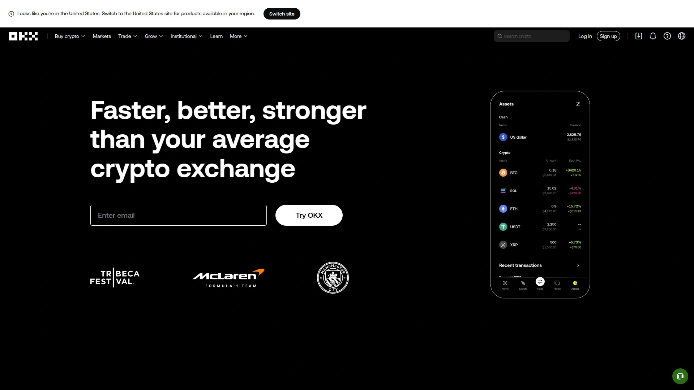
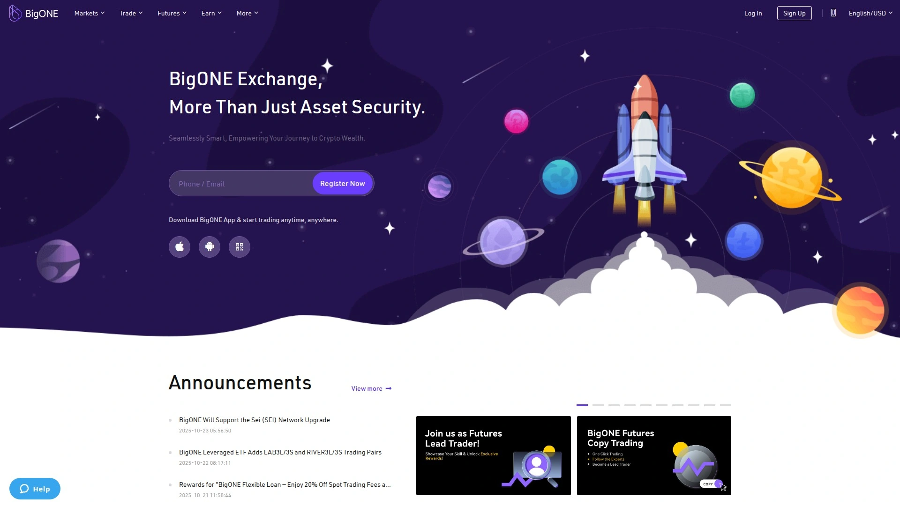

# Top 32 Cryptocurrency Exchanges Ranked in 2025 (Continuously Updated)

Whether you're buying your first Bitcoin or managing a diverse portfolio of digital assets, the right crypto trading platform makes all the difference. From low-fee spot trading to advanced derivatives, finding an exchange that matches your needs—security, coin selection, and ease of use—can transform your crypto journey from confusing to rewarding.

## **[Poloniex](https://poloniex.com)**

A veteran exchange designed for both newcomers and seasoned crypto traders.

Poloniex launched in 2014 and has built its reputation on straightforward spot trading across dozens of cryptocurrencies. The platform balances user-friendly design with technical depth, making it accessible whether you're placing your first Bitcoin order or executing complex trades.

What makes Poloniex stand out is its clean trading interface that doesn't overwhelm beginners but still packs the charting tools experienced traders expect. You get access to popular pairs like BTC/USDT, ETH/USDT, and a rotating selection of altcoins that keeps things interesting without drowning you in obscure tokens.

The fee structure is competitive, starting at reasonable rates for casual traders while offering volume-based reductions for active users. Deposits are processed quickly, and the platform supports both crypto-to-crypto trading and select fiat options depending on your region.

Security measures include two-factor authentication, cold storage for the majority of funds, and regular security audits. The exchange has weathered the ups and downs of crypto markets and continues serving a global user base across multiple continents.

For those looking to expand beyond basic buying and selling, Poloniex offers margin trading and futures contracts on select pairs, though these features are better suited for users who understand the risks involved.

## **[Binance](https://www.binance.com)**

The trading volume giant with the deepest liquidity pools in crypto.

Binance processes billions in daily volume, which translates to better prices and faster execution for traders. With 600+ cryptocurrencies available, from Bitcoin to the newest DeFi tokens, you're rarely limited by asset selection.

The platform operates two interfaces: a simplified version for beginners and Binance Advanced for those who want full control. Trading fees start at 0.1% but drop significantly if you use BNB (Binance's native token) to pay, with active traders paying as little as 0.02%. Beyond spot trading, Binance offers futures, margin trading, staking, and even a launchpad for new projects. The mobile app is polished and handles the full feature set without feeling cramped.

Security is layered with SAFU (Secure Asset Fund for Users), a billion-dollar insurance pool that backs user funds. While Binance faces regulatory scrutiny in certain regions like the U.S., it remains the go-to platform for traders who prioritize liquidity and variety.

## **[Kraken](https://www.kraken.com)**

A transparency-focused exchange built for traders who care about regulatory compliance.

Founded in 2011, Kraken pioneered the proof-of-reserves concept, regularly publishing audits that verify customer funds. This transparency, combined with strong security practices, has earned trust among institutional and retail traders alike.

The exchange supports 480+ cryptocurrencies and offers both a standard interface and Kraken Pro for advanced trading. Fees are competitive at 0.16% maker / 0.26% taker for spot trades, with discounts for high-volume users. One unique advantage: Kraken Pro clients can also access 11,000+ U.S. stocks and ETFs directly within the platform, blending traditional finance with crypto in one account.

The platform handles fiat deposits and withdrawals smoothly, supporting multiple currencies including USD, EUR, GBP, and others. Staking is available for dozens of cryptocurrencies, letting you earn rewards on assets you're holding long-term. Customer support is responsive with 24/7 availability through live chat, making problem-solving faster than most competitors.

## **[Coinbase](https://www.coinbase.com)**

The publicly-traded exchange that prioritizes simplicity and regulatory credibility.

Coinbase went public in 2021, subjecting itself to SEC oversight and quarterly financial disclosures—transparency you won't find at most crypto platforms. This regulatory compliance makes it a safer entry point for beginners and institutions nervous about the Wild West reputation of crypto.

The interface is deliberately simple. You can buy Bitcoin in three clicks, making it perfect for your first crypto purchase. For experienced traders, Coinbase Advanced offers lower fees (0.60% maker / 1.20% taker at base level) and professional charting tools. The platform supports 250+ cryptocurrencies, covering all major coins plus plenty of emerging projects.

Security features include two-factor authentication, cold storage for 98% of funds, and biometric login on mobile apps. Coinbase also offers educational modules that pay you in crypto for learning, a clever onboarding tool for newcomers. The Coinbase Card lets you spend crypto at millions of retailers, bridging the gap between digital assets and everyday purchases.

## **[Bybit](https://www.bybit.com)**

A derivatives-focused platform engineered for serious trading performance.

Bybit's trading engine handles 100,000 transactions per second with near-zero downtime, making it the choice for professional traders who can't afford lag during volatile market swings. The platform excels at futures and options trading, offering up to 100x leverage on select pairs—though high leverage requires careful risk management.

The interface integrates TradingView charts directly, giving you access to hundreds of technical indicators without leaving the platform. Spot trading fees start at 0.1% and drop to 0.02% for high-volume users. Bybit also provides copy trading, letting beginners mirror the strategies of successful traders automatically.

Fiat deposits are supported via bank transfers with zero fees in major currencies, a competitive edge over many exchanges that force you through expensive third-party processors. The mobile app replicates the desktop experience completely, unusual for platforms with this level of complexity. Bybit's Earn products let you stake assets or provide liquidity for passive income, though returns vary with market conditions.

## **[OKX](https://www.okx.com)**

A Web3-integrated exchange connecting traditional trading with decentralized finance.

OKX offers 350+ cryptocurrencies across 500+ trading pairs, but what sets it apart is its Web3 wallet integration. This lets you trade on the centralized exchange while also accessing DeFi protocols, NFT marketplaces, and decentralized apps—all from one dashboard.

Trading fees are among the lowest in the industry, with makers paying 0% and takers 0.08% at standard tier. The platform supports spot, margin, futures, and options trading with up to 125x leverage. OKX's mobile app is particularly strong, handling everything from simple buys to complex derivatives without sacrificing usability.

The exchange operates a robust launchpad for new projects, giving early access to tokens before they hit the broader market. Staking and lending options are extensive, covering dozens of cryptocurrencies with competitive yields. Security includes multi-signature wallets, cold storage, and mandatory 2FA for withdrawals.

## **[Gemini](https://www.gemini.com)**

The security-first exchange built by the Winklevoss twins for cautious investors.

Gemini was the first crypto exchange to achieve SOC 1 Type 2 and SOC 2 Type 2 certifications, meeting standards typically reserved for traditional financial institutions. The platform operates as a regulated trust company in New York, subjecting it to strict oversight that many competitors avoid.

The exchange supports 70+ major cryptocurrencies—a deliberately curated selection focusing on quality over quantity. Trading happens on two interfaces: the standard app for simple buys and ActiveTrader for advanced users who want full order book control. Fees are higher than average at 1.49% for small transactions, but the security infrastructure justifies the premium for risk-averse users.

Gemini stores the majority of client funds offline in geographically distributed cold storage, protecting against both cyberattacks and physical disasters. Insurance coverage extends to assets in the hot wallet, adding another layer of protection. The Gemini Credit Card offers crypto rewards on purchases, and Gemini Pay lets you spend digital assets at thousands of retail locations.

## **[KuCoin](https://www.kucoin.com)**

An altcoin paradise with 700+ cryptocurrencies for exploratory traders.

KuCoin lists more cryptocurrencies than almost any competitor, making it the destination for traders hunting micro-cap gems before they explode. The platform adds new tokens constantly, often listing projects weeks before they reach larger exchanges.

Trading fees start at 0.1% for both makers and takers, with discounts available if you hold KCS (KuCoin's native token). You can trade up to 1 BTC daily without KYC verification, appealing to users who value privacy. The exchange offers spot, margin, and futures trading, plus a lending platform where you can earn interest on holdings.

KuCoin Spotlight, the platform's launchpad, has produced some remarkable returns for early participants in featured projects. The trading bot marketplace lets you deploy automated strategies without coding knowledge. NFT functionality includes a marketplace and minting tools, making KuCoin a one-stop shop for diverse crypto activities.

## **[Bitget](https://www.bitget.com)**

A copy trading specialist that lets beginners follow expert strategies automatically.

Bitget has carved its niche with the best copy trading functionality in the space. You can browse successful traders, review their performance history, and automatically mirror their positions—perfect for learning while you earn. The platform supports 500+ cryptocurrencies across spot, futures, and margin trading.

Standard trading fees are flat at 0.1% for makers and takers, simple and transparent. Bitget launched native fiat support via bank transfers with zero fees, eliminating the costly third-party processors most exchanges rely on. The Earn section offers staking, flexible savings, and dual-currency investments for generating passive income.

Security features include cold storage, proof-of-reserves audits, and multi-signature wallets. The mobile app is particularly user-friendly, with a clean design that makes complex features accessible. Bitget Launchpad gives early access to new projects, though quality varies and requires careful research before participating.

## **[MEXC](https://www.mexc.com)**

The fastest-listing exchange with 1,500+ coins and zero-fee spot trading.

MEXC's superpower is speed. New tokens appear on MEXC 1-3 days after project application, dramatically faster than competitors who take weeks. This makes it a hunting ground for traders chasing the next 100x altcoin, though speed also means higher risk on newer listings.

Zero-fee spot trading on many pairs gives MEXC a major cost advantage, especially for active traders. Futures trading supports high leverage with solid liquidity depth. The platform has grown to 36 million users globally, concentrated in Southeast Asia, Europe, and Latin America.

The exchange offers AI-powered risk controls for margin and futures trading, automatically adjusting position limits based on volatility. Multiple staking options and launchpad access provide passive income opportunities. While MEXC operates under lighter regulation than U.S.-focused exchanges, it maintains security through cold storage, 2FA, and reserve audits.

## **[Gate.io](https://www.gate.com)**

A veteran platform with 3,800+ cryptocurrencies and institutional-grade tools.

Gate.io, founded in 2013, offers one of the largest cryptocurrency selections available anywhere. The platform excels at listing emerging projects early, making it a favorite for discovering promising tokens before mainstream exchanges pick them up.

Trading fees are 0.2% for spot trades, with volume-based discounts reducing costs for active users. The platform supports copy trading, trading bots, and advanced order types that appeal to technical traders. Margin trading is available with competitive rates, and futures contracts cover major cryptocurrencies with up to 125x leverage.

Gate.io's Earn products include staking, lending, and yield farming across 500+ assets. The NFT marketplace lets you trade digital collectibles, and the crypto loan service allows borrowing against your holdings without selling. Customer support operates 24/7 via live chat, email, and social media, with generally positive community ratings. The platform restricts service in the U.S., Canada, and several other regions, so check availability before signing up.

## **[Crypto.com](https://www.crypto.com)**

A mobile-first ecosystem with a Visa card that earns crypto rewards.

Crypto.com built its platform around the mobile experience, recognizing that most users prefer trading on their phones. The app is polished and handles everything from basic purchases to advanced trading without feeling cramped. The platform supports 400+ cryptocurrencies with competitive 0.25% maker / 0.50% taker fees.

The standout feature is the Crypto.com Visa Card, which earns cashback in CRO (the platform's native token) on all purchases. Higher card tiers offer perks like free Netflix subscriptions, Spotify reimbursement, and airport lounge access. Staking is available for select assets, and the Earn program offers interest on deposits of stablecoins and major cryptocurrencies.

The exchange operates an NFT marketplace featuring exclusive drops from major brands and athletes. Security includes cold storage, 2FA, and insurance on custodied assets. While the U.S. version has fewer features than international offerings due to regulatory constraints, Crypto.com remains a solid choice for users who want their exchange to feel like a modern fintech app.

## **[Bitstamp](https://www.bitstamp.com)**

The oldest surviving exchange with a decade-plus track record of stability.

Founded in 2011, Bitstamp has outlasted countless competitors by focusing on reliability over flashy features. The platform offers 110+ cryptocurrencies—not the largest selection, but enough to cover all major assets and popular altcoins.

Fees are flat at 0.30% maker / 0.40% taker across all volume tiers, making costs predictable. The interface is deliberately simple, appealing to users who want to buy, hold, and occasionally sell without navigating complex trading tools. For advanced users, Bitstamp Pro provides professional charting and order types.

The exchange emphasizes regulatory compliance, operating under licenses in the EU, UK, and U.S. (partnered with Robinhood for U.S. markets). Security features include multi-signature wallets, cold storage, and 2FA. While Bitstamp doesn't offer the bleeding-edge features of newer exchanges, its boring reliability makes it perfect for conservative investors who prioritize long-term safety.

## **[HTX](https://www.htx.com)**

A derivatives powerhouse with deep liquidity in futures markets.

HTX (formerly Huobi) has operated since 2013 and ranks among the largest exchanges by derivatives volume. The platform excels at futures and margin trading, offering contracts on major cryptocurrencies with up to 125x leverage and some of the deepest order books in the industry.

Spot trading fees are 0.04% for takers at base level, among the lowest available. The exchange supports 500+ cryptocurrencies and continually adds new projects. HTX operates a launchpad, staking services, and an Earn program for passive income generation.

The platform launched international exchanges in Singapore and Japan, demonstrating commitment to regulatory compliance in major markets. Security includes cold storage, proof-of-reserves, and 24/7 monitoring. The mobile app provides full functionality without sacrificing desktop features, making it viable for serious trading on the go.

## **[XT.COM](https://www.xt.com)**

A rapidly growing exchange with 7.8 million users and intuitive design.

Founded in 2018, XT.COM has grown quickly by focusing on user experience and responsive support. The platform offers a clean interface that works equally well for beginners and experienced traders, with live customer support available for real-time problem-solving.

The exchange lists hundreds of cryptocurrencies across spot and futures markets. Trading fees are competitive, and the platform regularly runs promotions offering reduced rates or trading bonuses. XT.COM emphasizes security through cold storage, encryption, and mandatory 2FA for withdrawals.

What sets XT.COM apart is its onboarding process, which includes tutorials and guided walkthroughs that reduce friction for new users. The referral system rewards users for bringing friends to the platform, creating organic growth. While not yet a household name like Binance or Coinbase, XT.COM represents the new generation of exchanges that prioritize user experience alongside trading features.

## **[Bitfinex](https://www.bitfinex.com)**

A professional trader's platform with advanced order types and deep liquidity.

Bitfinex launched in 2012 and caters to experienced traders who need precision tools. The platform offers some of the deepest liquidity in BTC and ETH pairs, ensuring minimal slippage even on large orders. Margin trading is available with up to 10x leverage, and the platform supports complex order types like scaled orders and algorithmic strategies.

Fees start at 0.1% maker / 0.2% taker and decrease significantly with volume. The interface is information-dense, showing real-time data across multiple panels—overwhelming for beginners but exactly what professional traders want. Bitfinex operates its own stablecoin (USDT via Tether), giving it unique liquidity advantages.

The platform has weathered multiple controversies over the years but maintains a loyal user base of sophisticated traders. Security includes cold storage and 2FA, though users should always practice proper asset management regardless of exchange. Bitfinex is not available in the U.S. and restricts service in several other jurisdictions.

## **[Uphold](https://uphold.com)**

A multi-asset platform trading crypto alongside stocks and precious metals.

Uphold blurs the line between crypto exchange and brokerage, letting you trade digital assets, equities, and commodities from one account. The platform supports 200+ cryptocurrencies plus access to traditional markets, appealing to diversified investors.

The fee structure is transparent: spreads around 1% plus small transaction fees. While not the cheapest option for dedicated crypto traders, the all-in-one approach saves the hassle of managing multiple accounts. Uphold processes instant deposits and withdrawals in many jurisdictions, eliminating the waiting period common at other exchanges.

The platform emphasizes financial inclusion, operating in 180+ countries including many underserved by traditional exchanges. Security features include 2FA, encryption, and segregated customer accounts. The mobile app handles both crypto and traditional assets seamlessly, making portfolio management straightforward.

## **[Huobi](https://www.huobi.com)**

A global exchange network with strong presence in Asian markets.

Huobi operates exchanges in multiple countries, adapting to local regulations while maintaining a unified trading experience. The platform supports 500+ cryptocurrencies and processes significant volume in derivatives trading, particularly in Asian time zones.

Trading fees start at 0.04% for takers, competitively priced among major exchanges. Huobi offers spot, margin, and futures trading with up to 125x leverage on select contracts. The Earn section provides staking and lending opportunities across dozens of assets.

The exchange has survived regulatory challenges in China and expanded internationally, demonstrating adaptability. Security includes proof-of-reserves, cold storage, and comprehensive insurance coverage. The platform's strength lies in its liquidity during Asian market hours and its deep connections to emerging projects in that region.

## **[Phemex](https://phemex.com)**

A zero-fee exchange optimizing for cost-conscious traders.

Phemex differentiates itself by offering zero-fee spot trading on select pairs, eliminating trading costs entirely for basic buys and sells. The platform supports 150+ cryptocurrencies with both spot and derivatives markets available.

For futures trading, Phemex offers competitive fees and leverage up to 100x on major pairs. The platform launched premium membership tiers that provide additional benefits like higher withdrawal limits and priority customer support. Social trading features let beginners follow experienced traders, similar to eToro's model.

Security features include cold storage, 2FA, and regular security audits. The platform operates under Seychelles regulation, giving it flexibility to serve global users while maintaining baseline security standards. Phemex's mobile app replicates the full desktop experience, making it viable for active trading on the go.

## **[AscendEX](https://ascendex.com)**

An innovation-focused exchange with early access to emerging DeFi projects.

AscendEX (formerly BitMax) positions itself at the intersection of centralized and decentralized finance. The platform lists 200+ cryptocurrencies with a particular focus on DeFi tokens and projects building on newer blockchains like Avalanche and Solana.

Trading fees are 0.04% maker / 0.06% taker, among the lowest in the industry. Margin trading is available with competitive rates, and the exchange offers staking rewards on dozens of assets. AscendEX operates a launchpad that has featured several successful projects, giving users early entry to promising tokens.

The platform's yield farming products connect centralized exchange users with DeFi protocols, simplifying access to complex strategies. Security includes multi-signature wallets, cold storage, and insurance coverage. While AscendEX has a smaller user base than giants like Binance, it compensates with curated listings and attentive customer support.

## **[Bithumb](https://www.bithumb.com)**

A South Korean powerhouse dominating local crypto trading.

Bithumb is the largest cryptocurrency exchange in South Korea, processing massive volume in won-denominated pairs. The platform supports 200+ cryptocurrencies with deep liquidity in Korean market hours. Trading fees are competitive at 0.25% for both makers and takers.

The exchange emphasizes security with features like biometric login, cold storage for most funds, and insurance coverage against hacks. Bithumb operates a mobile-first platform optimized for the Korean market's preference for phone-based trading. Staking services are available for major proof-of-stake cryptocurrencies.

While the platform primarily serves Korean users with won deposits, it accepts international traders for crypto-to-crypto pairs. The exchange has weathered several security incidents over the years but continues operating as a major regional player. Customer support is available 24/7 in Korean with limited English support.

## **[Bitrue](https://www.bitrue.com)**

A XRP-friendly exchange with extensive Ripple ecosystem support.

Bitrue built its reputation on strong support for XRP and other Ripple-related assets, making it the go-to platform for enthusiasts of that ecosystem. The exchange supports 400+ cryptocurrencies across spot, margin, and futures markets.

Trading fees start at 0.098% for both makers and takers, with discounts available for holding BTR (Bitrue's native token). The platform offers Power Piggy, a flexible savings product that pays interest on deposited assets with no lockup period. Yield farming opportunities are extensive, covering dozens of tokens.

Bitrue operates investment pools that let users participate in new token launches, similar to launchpads at larger exchanges. The platform has expanded beyond its XRP focus but maintains that community's loyalty through specialized trading pairs and staking options. Security includes cold storage, 2FA, and regular third-party audits.

## **[Poloniex](https://poloniex.com)** (Additional Context)

For spot trading specifically, Poloniex shines with its straightforward approach—no unnecessary complexity, just solid execution on the pairs you actually want to trade. The platform's longevity speaks to its ability to adapt through multiple market cycles while maintaining consistent service.

## **[CoinEx](https://www.coinex.com)**

A user-friendly exchange with AMM trading and perpetual contracts.

CoinEx combines centralized exchange functionality with automated market maker (AMM) features typically found on decentralized platforms. This hybrid approach provides consistent liquidity even on smaller trading pairs. The platform supports 400+ cryptocurrencies across spot and derivatives markets.

Trading fees are 0.1% for spot trading, with discounts for holding CET (CoinEx's token). Perpetual contracts are available with up to 100x leverage on major pairs. The exchange operates a one-click staking system that simplifies earning rewards on proof-of-stake assets.

CoinEx emphasizes global accessibility, operating in 200+ countries with multilingual support. The platform offers financial services beyond trading, including crypto loans and fixed-income products. Security features include cold storage, 2FA, and regular security assessments.

## **[BitMart](https://www.bitmart.com)**

A growth-focused exchange expanding globally with competitive features.

BitMart operates in 180+ countries and supports 1,000+ cryptocurrencies, positioning itself as a global alternative to region-specific exchanges. Trading fees start at 0.25% for spot trades with volume-based reductions for active users.

The platform offers copy trading, letting beginners automatically follow successful traders' strategies. Margin trading is available with up to 10x leverage, and futures contracts cover major cryptocurrencies. BitMart operates a launchpad for new projects and an Earn program offering staking rewards.

Security includes insurance coverage against hacks, cold storage for most funds, and mandatory 2FA for withdrawals. The mobile app provides full functionality without requiring desktop access. While BitMart faced a security breach in 2021, it fully reimbursed affected users and strengthened security protocols.

## **[LBank](https://www.lbank.com)**

An altcoin-rich platform with focus on emerging Asian projects.

LBank supports 700+ trading pairs with particular strength in Asian market listings. The exchange often lists projects early in their lifecycle, attracting traders hunting for undervalued gems. Trading fees are 0.1% across all pairs with discounts for holding LBK tokens.

The platform offers spot, margin, and futures trading with solid liquidity on popular pairs. LBank operates an ETF trading section that packages multiple cryptocurrencies into single tradeable products, simplifying diversification. Staking services cover dozens of proof-of-stake assets with competitive yields.

Security features include cold storage, multi-signature wallets, and 2FA requirements. The exchange has partnered with various blockchain projects to offer exclusive trading events and airdrops to active users. Customer support operates 24/7 via multiple channels including live chat and social media.

## **[ProBit](https://www.probit.com)**

A community-focused exchange with voting-based listing decisions.

ProBit lets users vote on which new tokens get listed, democratizing the selection process. The platform supports 400+ cryptocurrencies with both spot and futures trading available. Trading fees are 0.2% for makers and takers at base level.

The exchange operates a unique staking system where holding PROB tokens provides benefits like reduced fees and early access to new listings. IEO (Initial Exchange Offering) participation is available to token holders, giving retail investors access to early-stage projects typically reserved for institutions.

ProBit emphasizes transparency, publishing regular reports on trading volume, reserves, and operational metrics. Security includes cold storage for most assets, 2FA, and IP whitelisting for withdrawals. The platform serves global users with support for multiple fiat currencies.

## **[WhiteBIT](https://whitebit.com)**

A European-focused exchange emphasizing regulatory compliance.

WhiteBIT operates under European regulatory frameworks, appealing to users who prioritize legal compliance. The platform supports 500+ cryptocurrencies with spot, margin, and futures trading available. Trading fees start at 0.1% for spot trades with volume-based reductions.

The exchange offers fiat on-ramps supporting EUR, USD, and other currencies via bank transfers and credit cards. WhiteBIT Smart Staking automatically compounds rewards, maximizing returns on deposited assets. The platform's lending market lets users earn interest or borrow against holdings.

Security features include cold storage, 2FA, and comprehensive insurance against operational failures. The mobile app provides full trading functionality with a clean, intuitive interface. WhiteBIT's customer support operates 24/7 with fast response times according to user reviews.

## **[BigONE](https://big.one)**

An exchange with integrated social features and community governance.

BigONE combines trading with social networking, letting users follow traders, share strategies, and discuss market trends within the platform. The exchange supports 200+ cryptocurrencies with spot and margin trading available.

Trading fees are 0.1% for both makers and takers, with discounts for holding ONE tokens. The platform operates a unique wealth management system where professional traders manage pooled funds, splitting profits with participants. Staking services cover major proof-of-stake assets with competitive yields.

BigONE emphasizes community governance, letting token holders vote on platform decisions and new feature implementations. Security includes cold storage, multi-signature wallets, and regular third-party audits. The platform's strength lies in its active community rather than raw trading volume.

## **[BTCC](https://www.btcc.com)**

One of the original exchanges with a focus on derivatives trading.

BTCC launched in 2011, making it one of the oldest cryptocurrency exchanges still operating. The platform specializes in futures and perpetual contracts with up to 150x leverage on major pairs. Trading fees are competitive at 0.03% maker / 0.05% taker for spot trades.

The exchange supports 100+ cryptocurrencies with deep liquidity in BTC and ETH pairs. BTCC offers copy trading features that let beginners automatically mirror successful traders' positions. The platform's mobile app handles both spot and derivatives trading without sacrificing functionality.

Security includes cold storage for most funds, 2FA, and withdrawal whitelist functionality. While BTCC's user base is smaller than newer competitors, its longevity demonstrates operational stability. The platform serves global users with support for multiple fiat currencies.

## **[CoinDCX](https://coindcx.com)**

India's largest cryptocurrency exchange navigating complex local regulations.

CoinDCX operates as India's leading exchange despite the country's evolving regulatory landscape. The platform supports 200+ cryptocurrencies with spot trading in INR (Indian Rupee) and crypto-to-crypto pairs. Trading fees are competitive at around 0.1% for spot trades.

The exchange offers systematic investment plans (SIPs) for crypto, letting users automatically invest fixed amounts on recurring schedules. CoinDCX operates lending and borrowing services plus fixed-income products that appeal to risk-averse Indian investors. The platform emphasizes education, offering tutorials specifically tailored to new Indian crypto users.

Security features include cold storage, 2FA, and insurance coverage. The exchange works closely with Indian banking partners to facilitate rupee deposits and withdrawals. While regulatory uncertainty remains a challenge, CoinDCX has positioned itself as the compliant choice for Indian traders.

## **[Liquid](https://www.liquid.com)**

A Japan-based exchange combining high liquidity with regulatory credibility.

Liquid operates under Japanese financial regulations, providing security-conscious traders with a compliant platform. The exchange supports 100+ cryptocurrencies with particularly deep liquidity in Asian market hours. Trading fees are 0% for makers and up to 0.1% for takers.

The platform offers loan services where users can borrow against crypto holdings or earn interest by lending. Liquid emphasizes institutional-grade security with cold storage, multi-signature wallets, and comprehensive insurance. The exchange partners with Japanese banks for smooth yen deposits and withdrawals.

While Liquid's cryptocurrency selection is smaller than global giants, its focus on quality over quantity appeals to conservative investors. The platform's mobile app provides full trading functionality optimized for Japanese users. Customer support is available in multiple languages with emphasis on Japanese and English.

## **[Zaif](https://zaif.jp)**

A Japanese exchange with unique coin-offering program for long-term investors.

Zaif operates under Japanese Financial Services Agency regulation, ensuring compliance with strict local requirements. The platform offers a unique "coin accumulation" service that automatically purchases small amounts of cryptocurrency on recurring schedules, similar to dollar-cost averaging.

The exchange supports major cryptocurrencies plus several Japanese-originated tokens not widely available elsewhere. Trading fees are competitive at around 0.1% for spot trades. Zaif partners with Japanese banks to enable smooth yen deposits and withdrawals without international transfer fees.

Security features include cold storage for most assets, 2FA, and SMS verification for withdrawals. The platform primarily serves Japanese users with limited English support. While Zaif has a smaller international presence, it remains relevant for Japanese investors seeking locally regulated access to crypto markets.

---

## What's the main difference between centralized and decentralized exchanges?

Centralized exchanges like Poloniex handle custody of your funds and provide customer support, making recovery possible if you forget passwords. They offer better liquidity and faster trades but require trusting the platform. Decentralized exchanges let you keep control of your assets but place all responsibility on you—lose your keys and your crypto is gone forever. For most users starting out, centralized platforms provide the right balance of convenience and security.

## How do I evaluate if an exchange's fees are reasonable?

Look beyond the advertised percentage to actual costs per trade. A 0.1% fee sounds cheap until you realize withdrawal fees eat another $25 on small transfers. Compare total costs for your typical trade size: deposit method fees, trading fees, and withdrawal fees. Volume-based discounts only matter if you trade enough to reach higher tiers. For casual investors buying monthly, flat-fee structures often cost less than percentage-based fees on small purchases.

## Should I keep crypto on an exchange or move it to a personal wallet?

If you're actively trading, keeping funds on the exchange makes sense for quick access. For long-term holdings you won't touch for months, moving to a hardware wallet eliminates exchange hack risk. Many users split the difference: trading stacks on exchanges, long-term holds in cold storage. Just remember that moving between wallets and exchanges incurs transaction fees and takes time, so plan accordingly.

---

Whether you're drawn to [Poloniex](https://poloniex.com) for its veteran reliability and clean trading interface, or exploring alternatives for specific features, the right exchange depends on your priorities. Beginners benefit from Poloniex's straightforward approach without overwhelming complexity, while experienced traders appreciate the depth of available pairs and consistent execution. No single platform serves every need perfectly, but starting with an established exchange that balances accessibility with solid fundamentals sets you up for success in crypto markets.
